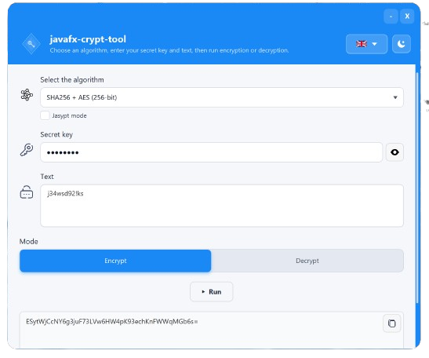

  

<h1 align="center">EncSeal</h1>

  A desktop utility for encrypting and decrypting text using strong password-based encryption. 
  Runs on Windows and Linux with no installation required.

---

  

---

## Download

Download the latest release from the [Releases page](https://github.com/ValerioGc/java-crypt-tool/releases):

- **Windows** → `javafx-crypt-tool-windows.zip` — extract and run `javafx-crypt-tool.exe`
- **Linux** → `javafx-crypt-tool-linux.tar.gz` — extract and run `javafx-crypt-tool`

No Java installation required. The runtime is bundled inside the package.

---

## How To Use

1. Select an **encryption algorithm** from the dropdown
2. Enter a **salting key** — a secret string used as part of the key derivation
3. Enter the **text** to encrypt or decrypt
4. Select **Encrypt** or **Decrypt** mode
5. Click **Run**
6. Use the copy button to copy the result

> The same salting key and algorithm used to encrypt must be used to decrypt.

### Jasypt compatibility mode

Enable the **Jasypt mode** checkbox to decrypt (or encrypt) text produced by Jasypt's `StandardPBEStringEncryptor`. Select the algorithm and iterations count that match your Jasypt configuration.

---

## Supported Algorithms

### EncSeal native

| Label | Key size |
|---|---|
| SHA256 + AES (128-bit) | 128 bit |
| SHA256 + AES (192-bit) | 192 bit |
| SHA256 + AES (256-bit) | 256 bit |

Uses 600,000 KDF iterations for strong key derivation.

### Jasypt compatibility mode

Exposes additional algorithms for interoperability with Jasypt `StandardPBEStringEncryptor`, including MD5+DES, SHA1+DESede, SHA256+AES variants and more. Unsupported algorithms are hidden automatically based on the current JVM.

---

## Supported Languages

English, Italian, French, Spanish, German — switchable from the header.

---

## Coming Soon

- File encryption and decryption (any format)
- OS context menu integration (right-click on any file)
- Windows installer

---

## Source

[https://github.com/ValerioGc/java-crypt-tool](https://github.com/ValerioGc/java-crypt-tool)

For build and development instructions see [DEVELOPMENT.md](DEVELOPMENT.md).
